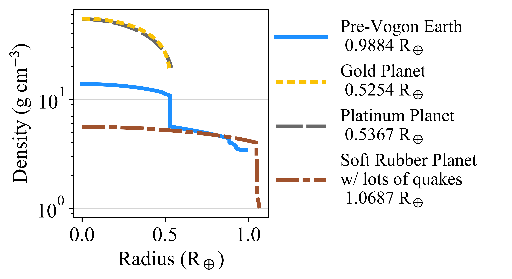

# MAGRATHEA #

**Excerpt from The Hitchhiker's Guide to the Galaxy, Page 634784, Section 5a, Entry: MAGRATHEA**

Planet interior structure code for astronomers, planetary scientists, mice, and more. 

## What is this repository for? ##

A 1D planet structure code written in C++ which considers the case of fully differentiated interiors. 
The code integrates the hydrostatic equation in order to shoot for the correct planet radius given the mass in each layer.
The code returns the pressure, temperature, density, phase, and radius at steps of enclosed mass.
The code supports 4 layers: core, mantle, hydrosphere, and atmosphere. Each layer has a phase diagram with equations of state (EOS) chosen for each phase.
The code was developed by Chenliang Huang, David R. Rice, and Jason H. Steffen at the Univerisity of Nevada, Las Vegas starting in 2017.
See a [list of works](citations.md) that use MAGRATHEA and [instructions on how to cite](CITATION.md). If you don't see something on this ReadMe check our publication in this repository: [*MAGRATHEA.pdf*](MAGRATHEA.pdf).

We encourage the community to contribute to and use MAGRATHEA for their interior modeling needs.

 

 

## Prerequisite ##

[Install the GSL library](https://www.gnu.org/software/gsl/)(>= v2.0).  Download the compressed package from the [GNU ftp site](ftp://ftp.gnu.org/gnu/gsl/).  Extract the file and install the package following the instruction in the `INSTALL` file.  For the simplest case, 
 
    sudo ./configure
    sudo make
    sudo make install

should configure, build, and install the gsl package.  A few prerequisites, such as `g++`, `make`, `make-guile`, may need to be install following the error messages throughout the process. 

On Ubuntu systems, the gsl package can also be installed from the Ubuntu repository using `sudo apt install libgsl27 libgsl-dev gsl-bin`. 

On Windows systems, we suggest using WSL and following the above isntructions.

If an error message like "error while loading shared libraries: libgsl.so.23: cannot open shared object file: No such file or directory" is reported when running the code, add `export LD_LIBRARY_PATH=/usr/local/lib` (directory of gsl library files) to the `.bashrc` file, or add `setenv LD_LIBRARY_PATH /usr/local/lib` to the `.cshrc` file.

## Quick Start ##

Installation:

1. Clone the repository: `git clone https://github.com/Huang-CL/Magrathea.git`.
2. If the gsl library is not installed globally (under /usr/local/ or equivalent), edit `Makefile` to include the actual path toward the gsl headers (e.g. `~/include` or `~/gsl/include`) and gsl library (e.g. `~/lib` or `~/gsl/lib`) following `-I` in `CFLAGS` and `-L` in `LDFLAGS`.  Note: The path after `-I` should end with `/include`, not `/include/gsl`.  The path of headers and libraries can be found using `gsl-config --cflags` and `gsl-config --libs`.  If the `gsl-config` command is not found, `gsl` may not have been installed properly.
3. Run `make -B` inside the code's directory. (After the first compilation use `make` to compile the code.)

Running a planet:

4. Open src/main.cpp in a text editor.
5. Line 29: set `input_mode=0` (other options are listed below the line).
6. Line 42*: set mass of the core, mantle, hydrosphere, and atmosphere in Earth-masses. Ex. Mcomp={0.3,0.7,0,0}
7. Line 40: set surface temperature and any temperature discontinuities. Ex. Tgap={0,0,0,300}
8. Line 52: set output file name.
9. Compile changed file with `make`.
9. Run MAGRATHEA with `./planet`.

*We promise that the primary input parameters occuring on Line 42 is only a coincedence and does not reveal the Ultimate Question.

## Capability and Output ##

MAGRATHEA uses a shooting to a fitting-point method with a Runge-Kutta-Fehlberg method with an adaptive step-size. The user's supplied mass fractions determine the enclosed mass at each layer's boundary. Within a layer the enclosed mass at which the phase changes is determined by P-T conditions. When a phase changes, the solver backs up to find the exact location of the phase change. The fitting point is at 20% the mass of the planet. The solver integrates until the inner and outer branch of integration agree at the fitting point with a relative error less than 10-4.

There are 7 modes with different functionality described below. The `input_mode` is set in Line 29 in `main.cpp`.

### Primary Modes ##
### input_mode=0 ###
The basic capability: calculate the structure of a planet given the mass of each layer.

Adjust the parameters of the `fitting_method()` function.  Input four parameters in `Mcomp` for the planet's core mass, mantle mass, hydrosphere mass, and atmosphere mass in the unit of Earth-mass.  Input four parameters in `Tgap` for the temperature of the surface and discontinuities in temperature at layer boundaries.  The first number is the size of the discontinuity betweeen the core and the mantle with the last number being the surface temperature.

The function also requires a guess for the density in each layer from `ave_rho` and the surface pressure from `P_surface` located at the top of main.cpp.  Default surface pressure is 100 mbar. Lastly, a conditional is required&mdash;`false` for temperature gradient and `true` to force isothermal condition throughout the planet.

The planet structure will be output as an ASCII file with pressure (GPa), interior mass (Earth mass), density (g cm-3), temperature (K), and phase of composition as a function of radius (Earth radius).

### input_mode=1 ###

Uses the `getmass()` function which assumes an isothermal planet. This function runs much quicker than the full solver. User provides the mass of the core, mantle, and hydrospehre in Earth-masses. No atmosphere layer is available in this solver. Outputs interior conditions to a file as in input_mode=0.

### input_mode=6 ###

This mode is for bulk inputs of planets using the solver from `input_mode=0` or 1. Requires a space separated file, where each row of the table lists the total mass in Earth-masses and fraction of mass in each layer for a planet.

Example input file:

    Mass  fCore  fMantle  fWater
    2     0.2    0.4      0.4
    1.5   0.5    0.39     0.1
	
Any remaining mass will be put into the atmosphere (i.e. 1% for the second planet).  Example input files can also be found under [run](run/).

After setting the input_mode, `main.cpp` does not need to be edited. The user will be prompted after running the command `.\planet` for which solver to use, the temperature, and input and output file names.

MAGRATHEA will generate an output file with mass of core, mantle, water, and atmosphere and the radius of the core, mantle, water, and planet for each line in the input file.  If the solution crosses the part of the phase diagram that the code has not been fully implemented, "Dummy EOS used" is added to the end of the raw.  If the solver cannot find the solution that meets the required accuracy with the given number of iteration, "Solution did not converge" is added.  "No solution found" is also possible in the output if the solver failed to find a solution.

### input_mode=7 ###

*Currently in development* Composition Finder. Takes a file of mass and radius measurements and uses a secant method to find the amount of water or atmosphere mass needed to match the radius across core to mantle ratios.

### Secondary Modes ###
### input_mode=2 ###

The fastest solver available using the `twolayer()` function.  Solves planets isothermally with only two layers using an inside-out shooting method.  Built to quickly make mass-radius curves with a constant mass ratio between the layers. 

The funciton is:

	twolayer(int index, double fraction, vector<double> &Mp, vector<double> &Rp, double P_surface, bool printmodel)

where `index`=0 is a planet with only mantle and hydrosphere (no core), =1 is only core and hydrosphere, =2 is core and mantle, `fraction` is the mass fraction of the inner layer, `Mp` is a list of planet masses, `P_surface` is surface pressure.  Returns radii of the masses inputed.

### input_mode=3,4,5 ###

These modes allow for changing an EOS in the model temporarily during a run (changing an EOS pernamently or adding an EOS discussed below). These modes can be used to measure how the uncertainty in a measurement affects a planet's radius. Mode 3 changes an EOS and uses the twolayer function. Mode 4 and Mode 5 iteratively change an EOS from an input file with the twolayer (Mode 2) and fullmodel (Mode 0) respectively.

For the moment, we save documenting how to create an input file for these modes for a later date. Examples of input files that change the EOSs are included in the run directory.

## Build your own planet model ##

MAGRATHEA is built for model flexibility with transparent storage structures for equations of state (EOS). We make it easy for users to build a reproduceable model and cite the material measurements that have gone into the model. EOSs built-in are described in MAGRATHEA.pdf.

The built-in EOSs for various planet building materials and phases are listed in the file `EOSlist.h`.  The detailed definition of each one can be found in `EOSlist.cpp`.

### Adding new equations of state ###

The code takes a new EOS in the format of (0) 3rd order Birch-Murnaghan, (1) 4th order Birch-Murnaghan, (2) Vinet, (3) Holzapfel, (4) Keane, (6) Ideal Gas, (7) Density-Pressure input table from file for interpolation, (8-12) same as 0-4 in combination with RTPress. 

New phases should be listed into the file `EOSlist.h` and defined in `EOSlist.cpp`.

Examples:

	// Epsilon Iron (hcp), Smith et al. 2018, Nature Astronomy. (Gruneisen determined from fitting Fig. 3b)
	// DEFAULT
	double Fe_hcp_array[][2] = {{0,2}, {1,mFe/8.43}, {2,177.7}, {3,5.64}, {5,mFe}, {7,322}, {8,2.09}, {9,1.01}, {10,0.0500}, {14,1}, {15,26}};
	EOS *Fe_hcp = new EOS("Fe hcp (Smith)", Fe_hcp_array, sizeof(Fe_hcp_array)/2/sizeof(Fe_hcp_array[0][0]));

	// Post-Perovskite, MgSiO3, Sakai, Dekura, & Hirao, 2016, Scientific Reports
	// DEFAULT
	double Si_PPv_Sakai_array[][2] = {{0,4}, {1,24.73}, {2,203}, {3,5.35}, {5,mMg+mSi+3*mO}, {7,848}, {8,1.47}, {9,2.7}, {10,0.93}, {14,5}};
	EOS *Si_PPv_Sakai = new EOS("Si PPv (Sakai)", Si_PPv_Sakai_array, sizeof(Si_PPv_Sakai_array)/2/sizeof(Si_PPv_Sakai_array[0][0]));

Index | Variable | Unit | Comment 
:---------: | :---------: | :----------: | -------------
0 | EOS formula type | | Index in parentheses above 
1 |	V0 | cm^3 mol^-1$ | Molar volume at reference point 
2 |	K0 | GPa | Bulk modulus 
3 |	K0' | | Pressure derivative of the bulk modulus. Default 4 
4 |	K0'' | GPa^-1 | Second pressure derivative 
5 |	m_mol | g mol^-1 | Molar mass 
6 |	P0 | GPa | The minimum pressure, corresponding to V0. Default 0
7 |	Theta0 | K | Fitting parameter of Einstein or Debye temperature. Default 1
8 |	gamma_0 | | Fitting parameter of Gruneisen parameter
9 | beta | | Fitting parameter of Gruneisen parameter
10 | gamma_inf | | Fitting parameter of Gruneisen parameter. Default 2/3
11 | gamma_0' | | Volume derivative of the Gruneisen parameter
12 | e0 | 10^-6$ K^-1 | Electronic contribution to Helmholtz free energy. Default 0
13 | g | | Electronic analogue of the Gruneisen parameter
14 | n | | Number of atoms in the chemical formula. Default 1
15 |  Z | | Atomic number (number of electron) 
16 | T0 | K | Reference temperature for the thermal pressure. Default 300 
17 | alpha0 | 10^-6 K^-1 | The zeroth order coefficient of thermal expansion at a reference pressure P0 
18 | alpha1 | 10^-6 K^-2 | The first order coefficient of thermal expansion at a reference pressure P0 
19 | xi | | Power law index in the coefficient of thermal expansion. Default 0 
20 | c_p0 | 10^7 erg g^-1 K^-1 | Specific heat capacity at constant pressure
21 | c_p1 | 10^7 erg g^-1 K^-2 | Coefficient for specific heat capacity
22 | c_p2 | 10^7 erg g^-1 K  | Coefficient for specific heat capacity
23 | Debye approx |  | Positive number for Debye, otherwise Einstein 
24 |thermal type | | See Paper

### Phase Diagrams ###

To pick desired materials/phases in each layer, change the corresponding return values of `find_water_phase`, `find_Fe_phase`, or `find_Si_phase` in `phase.cpp` using conditionals to set the desired pressure and temperature where the material/phase will exist.

Example:

	// Phase Diagram for Mantle 
	EOS* find_Si_phase(double P, double T)
	{
	   if (P <= 0 || T <= 0)
	   {
	     return NULL;
	   }
   	P /= 1E10;			// convert microbar to GPa
  	// Default Mantle
   	if(P > 112.5 + 7E-3*T)	// Phase transfer curve from Ono & Oganov 2005, Earth Planet. Sci. Lett. 236, 914
     		return Si_PPv_Sakai;
   	else if (T > 1830*pow(1+P/4.6, 0.33)) // Melting curve from Belonoshko et al. 2005 Eq. 2
     		return Si_Liquid_Wolf;
   	else
     		return Si_Pv;
 	}

### Useful unit conversions ###

The input parameters required to create an EOS in the program are typically in cgs units. However, the EOS measurement/calculation article may list their result in different units. Thus, the following unit conversions maybe helpful.

In the equations below, *m* is the number of formula units per unit cell. For example, cubic ice-VII (space group Pn3m) has two water molecules per unit cell, so *m=2*.
*n* is the number atoms per molecule formula. For example, MgSiO3 has 5 atoms in a molecule, so *n=5*.

* 1 &#8491;3/cell = 10-24NA/m cm3/mol = 0.6022/m cm3/mol.
* 1 &#8491;3/atom = 10-24nNA cm3/mol = 0.6022n cm3/mol.
* 1 eV/atom = 1.602&times;10-12nNA erg/mol = 9.649&times;1011n erg/mol. 
* 1 GPa = 1010&micro;bar = 0.01 Mbar.

### Several functions can be used to obtain the calculated planetary parameters ###
The functions in the table below can be used to obtain the calculated planetary parameters after a successful solving of planetary structure.

Function | Output unit | Comment
-------|:--------:|-----------
`double totalM()` | g | return the total mass of a planet
`double totalR()` | cm | return the total radius of a planet
`int getLayer_from_r(double r)` |  | Input radius in the RE, return the layer index `l` (from 0, count from bottom), rb(l)<=r*R⊕<rb(l+1)
`int getLayer_from_m(double m)` |  | Input mass in the ME, return the layer index `l` (from 0, count from bottom), M(l)<=m*M⊕<M(l+1)
`double getP(int l)` | &micro;bar | return the pressure at layer `l`
`double getM(int l)` | g | return the pressure at layer `l`
`double getR(int l)` | cm | return the radius at layer `l`
`double getrho(int l)` | g/ cm3 | return the ensity at layer `l`
`double getT(int l)` | K | return the temperature at layer `l`
`int getsize()` |  | return the total number of layers
`vector<double> getRs()` | R⊕ | Return the radii of core, mantle, and water layer, and the total radius in the unit of earth radii.
`vector<double> getTs()` | K | Return the temperatures at the outer side of each component interfaces as well as planet surface 

Example code:

    vector<double> Tgap = {0, 0, 0, 300};
    vector<double> Mcomp =  {1.0,0.5,0.1,0.00001}; 
    planet=fitting_method(Comp, Mcomp, Tgap, ave_rho, P_surface, false);
    if (planet)
    {
      int l = planet->getLayer_from_r(1);
      cout<<"layer:"<<l<<" P="<<planet->getP(l)<<"microbar R="<<planet->getR(l)/RE<<"REarth  rho="<<planet->getrho(l)<<"g/cm^3"<<endl;
      l = planet->getLayer_from_m(1);
      cout<<"layer:"<<l<<" P="<<planet->getP(l)<<"microbar M="<<planet->getM(l)/ME<<"MEarth  rho="<<planet->getrho(l)<<"g/cm^3"<<endl;
      vector<double> Rs = planet->getRs();
      vector<double> Ts = planet->getTs();
      for (int i=0; i<4; i++)
        cout<<planet->getLayer_from_r(Rs[i])<<' '<<Rs[i]<<"REarth "<<Ts[i]<<'K'<<endl;
    }

Example output:

	layer:605 P=1.21568e+11microbar R=0.998631REarth  rho=1.95656g/cm^3
	layer:547 P=1.5147e+12microbar M=0.999971MEarth  rho=11.8156g/cm^3
	547 0.726926REarth 630.97K
	602 0.978419REarth 460.504K
	682 1.07939REarth 300K
	752 1.12843REarth 300K

### Print EOS into a table ###

The code can print the pressure-density relation of a built-in EOS into an ASCII table by using the `printEOS` function of the EOS object. This can be a simple way to double check the EOS is set up correctly. The table covers the pressure range from 0.1 GPa (or P0 if it is larger) to 2000 GPa at the temperature T0 (default 300 K) of the EOS. The output table file is located at `./tabulated/phasename.txt`.

## Examples/Plots ##

Within the directories `run` and `result` are example input files and output files which are described in each directory's markdown (.md) file.

Python plotting scripts are included in the directory `plot`. Scripts are written for Python 3.6. Scripts may require matplotlib, numpy, astropy, python-ternary, regex, cmasher, and scipy.

### 3D Representations of Planets ###

Magrathea outputs can be imaged in the 3D open-source software Blender. Instructions and code are in https://github.com/DavidRRice/Blender-Magrathea.
 

 

## Don't Panic (FAQ) ##

**Who do I talk to?**

Find our emails on our websites:

Chenliang Huang, Shanghai Astronomical Observatory [website](https://huang-cl.github.io/)

David R. Rice, ARCO, Open University of Israel [website](https://davidrrice.github.io/)

**Where is the EOS/functionality I want?**

Open an issue with details of what you need. Future work includes implementing additional core alloys, more phases of water, a
thermodynamic Ice X, and atmosphere EOSs. 

**What if I need to model a planet, but I'm currently being tortured by Vogon poetry?**

We are open to collaborations! Emails found on websites above.

**Where do I find other codes for exoplanet modeling?**

MAGRATHEA and many other useful exoplanet-related codes are archived on NASA's [Exoplanet Modeling and Analysis Center](https://emac.gsfc.nasa.gov/).

**Where does the name MAGRATHEA come from?**

Magrathea is a fictional planet in Douglas Adams's *The Hitchiker's Guide to the Galaxy*: 

"for all the richest and most successful merchants life inevitably became rather dull and niggly, and they began to imagine that this was therefore the fault of the worlds they'd settled on... And thus were created the conditions for a staggering new form of specialist industry: custom-made luxury planet building. The home of this industry was the planet Magrathea, where hyperspatial engineers sucked matter through white holes in space to form it into dream planets- gold planets, platinum planets, soft rubber planets with lots of earthquakes- all lovingly made to meet the exacting standards that the Galaxy's richest men naturally came to expect.

But so successful was this venture that Magrathea itself soon became the richest planet of all time and the rest of the Galaxy was reduced to abject poverty. And so the system broke down, the Empire collapsed, and a long sullen silence settled over a billion worlds...

Magrathea itself disappeared and its memory soon passed into the obscurity of legend. In these enlightened days of course, no one believes a word of it."

---

*MAGRATHEA is supported by the [Nevada Center for Astrophysics](https://www.physics.unlv.edu/~bzhang/NCfA.html), University of Nevada, Las Vegas's [Physics & Astronomy Department](https://www.physics.unlv.edu/) and [Star & Planet Formation Group](https://unlv-spfg.github.io/), and University of Arizona's [Lunar and Planetary Laboratory](https://www.lpl.arizona.edu/)*
